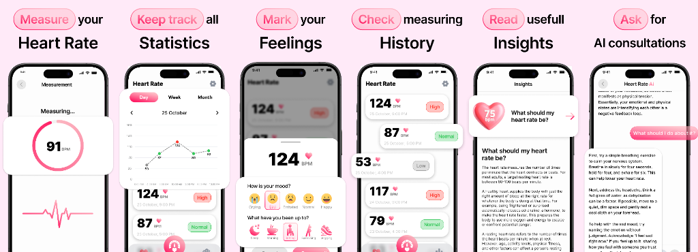
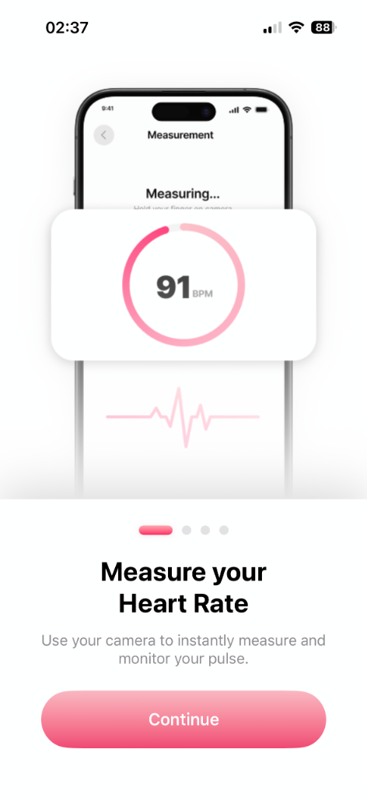
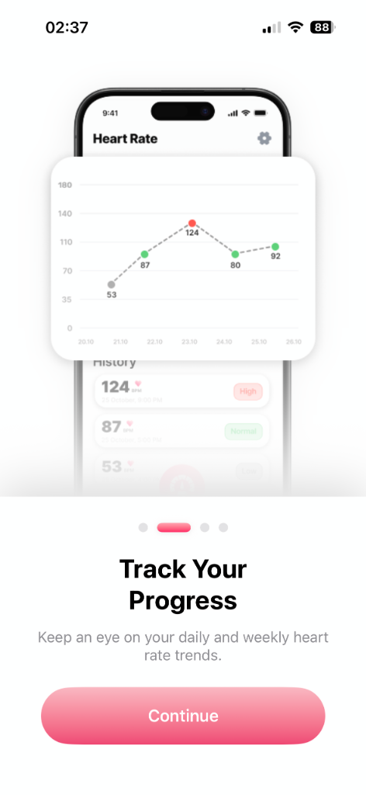
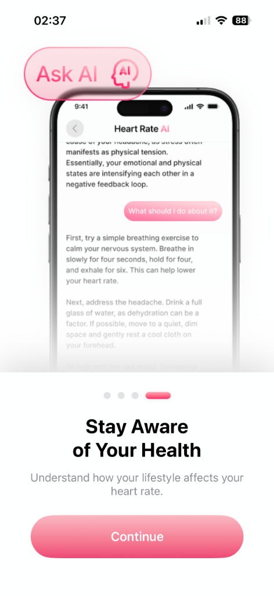
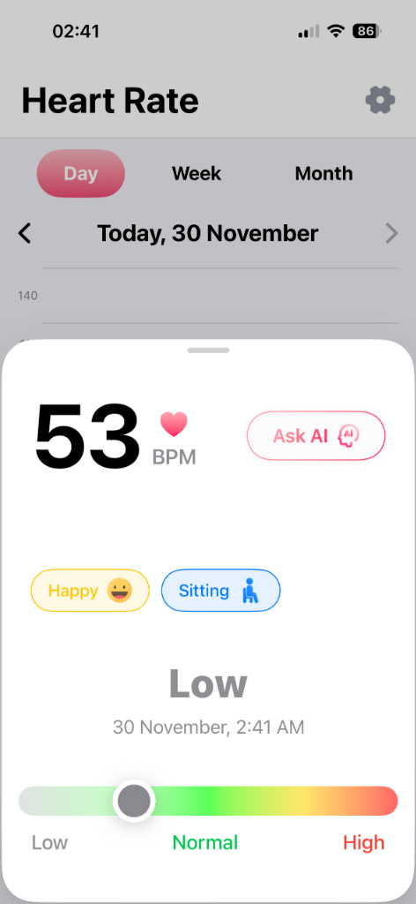
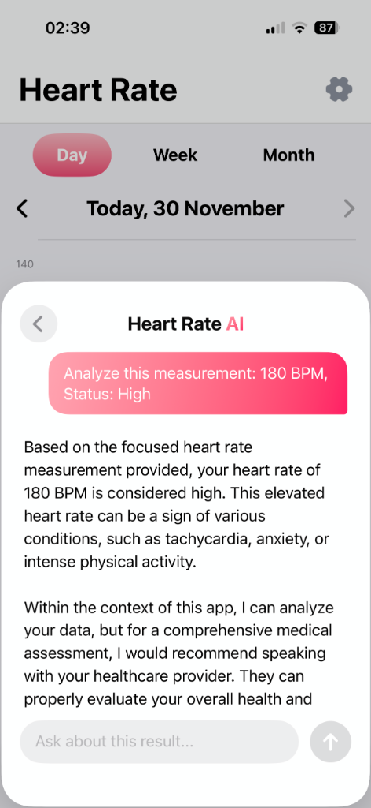
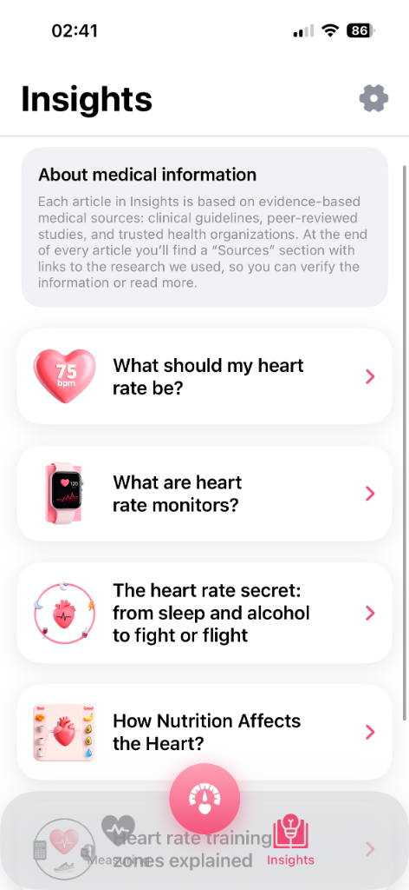

# ❤️ AI Pulse: Daily Heart Tracker
<a id="english"></a>

<div align="center">



[](https://developer.apple.com/ios/)
[](https://swift.org)
[](https://developer.apple.com/xcode/swiftui/)
[](https://github.com/adik/AI-Pulse-Daily-Heart-Tracker)

[](https://developer.apple.com/documentation/avfoundation)
[](https://developer.apple.com/documentation/charts)
[](https://www.anthropic.com)
[](https://en.wikipedia.org/wiki/Model%E2%80%93view%E2%80%93viewmodel)
[](LICENSE)

<br>

**[Читать на русском](#russian)**

</div>

---

## 💡 Engineering Overview

**AI Pulse** is a high-performance, native iOS application that leverages advanced signal processing (PPG) to transform an iPhone into a clinical-grade heart rate monitor.

Designed with a **"Native-First" philosophy**, this project demonstrates how to build complex, scalable applications **without a single third-party dependency**. It showcases mastery of the Apple ecosystem, utilizing `AVFoundation` for real-time capture, `Accelerate` concepts for signal analysis, and `SwiftUI` for a fluid, 60fps interface.

This codebase serves as a reference implementation for **Senior iOS Architecture**, prioritizing modularity, testability, and long-term maintainability.

---

## 📱 Application Showcase

<div align="center">

### Onboarding

| **Measure** | **Track** | **History** | **Awareness** |
|:---:|:---:|:---:|:---:|
|  |  |  |  |

### Features

| **Measurement** | **History** | **AI Analysis** | **Insights** | **Paywall** |
|:---:|:---:|:---:|:---:|:---:|
|  |  |  |  |  |

</div>

---

## 🛠 Technical Architecture & Stack

The project is architected using a strict **MVVM (Model-View-ViewModel)** pattern with a **Service-Oriented Layer**, ensuring a clear separation of concerns and adherence to SOLID principles.

### 🚀 The "Zero-Dependency" Advantage
Unlike typical apps bloated with third-party libraries, AI Pulse relies 100% on native Apple frameworks. This results in:
*   **Minimal App Size:** No unused binary code.
*   **Maximum Performance:** Direct access to metal-close APIs.
*   **Future-Proofing:** No risk of abandoned libraries or breaking changes.

### 🧩 Core Modules & Implementation

| Module | Native Frameworks | Engineering Highlights |
| :--- | :--- | :--- |
| **Signal Processing** | `AVFoundation`, `CoreImage` | Custom `PulseDetector` engine. Processes raw video buffers in real-time to extract PPG signals by analyzing hue variations in the user's fingertip. |
| **AI Intelligence** | `URLSession`, `Codable` | Lightweight networking layer connecting to **Claude 3**. Implements robust error handling and async/await concurrency for non-blocking UI. |
| **Data Visualization** | `Swift Charts` | High-performance, interactive charting. Uses declarative syntax to render complex health datasets smoothly. |
| **Persistence** | `AppStorage`, `UserDefaults` | Efficient local storage for user preferences and measurement history, abstracted via a `StorageService` protocol. |
| **Monetization** | `StoreKit 2` | Modern, async-based in-app purchase implementation. Handles entitlements, restoring, and subscription status with native Swift concurrency. |

---

## 📂 Project Structure

The folder structure reflects a **Feature-Based** organization, making the codebase easy to navigate and scale.

```text
AI-Pulse-Daily-Heart-Tracker/
├── Heart Rate/
│   ├── App/                 # Composition Root & App Lifecycle
│   ├── Core/                # Shared Infrastructure (Networking, Storage)
│   │   ├── PulseDetector/   # Signal Processing Engine
│   │   └── Managers/        # Session Management
│   ├── Models/              # Domain Entities (Immutable Structs)
│   ├── Screens/             # Feature Modules (MVVM)
│   │   ├── Measuring/       # Camera & Real-time Analysis
│   │   ├── Insights/        # AI Content Delivery
│   │   ├── Paywall/         # Revenue Logic
│   │   └── ...
│   ├── Components/          # Design System (Atomic UI Elements)
│   └── Services/            # Business Logic Protocols
└── docs/                    # Documentation & Assets
```

---

<br>
<br>
<br>

# ❤️ AI Pulse: Трекер Сердечного Ритма
<a id="russian"></a>

<div align="center">

**[Read in English](#english)**

</div>

---

## 💡 Инженерный Обзор

**AI Pulse** — это высокопроизводительное нативное приложение, использующее передовую обработку сигналов (PPG) для превращения iPhone в медицинский пульсометр.

Разработанное с философией **"Native-First"**, это приложение демонстрирует, как создавать сложные, масштабируемые продукты **без единой сторонней зависимости**. Проект показывает глубокое понимание экосистемы Apple, используя `AVFoundation` для захвата видеопотока, алгоритмы анализа сигналов и `SwiftUI` для интерфейса с частотой 60 кадров в секунду.

Этот проект служит эталонной реализацией **Senior iOS Architecture**, ставя во главу угла модульность, тестируемость и простоту поддержки.

---

## 🛠 Технический Стек и Архитектура

Приложение построено на строгом паттерне **MVVM** с **Сервис-Ориентированным слоем**, обеспечивая четкое разделение ответственности и соблюдение принципов SOLID.

### 🚀 Преимущество "Нулевых Зависимостей"
В отличие от приложений, перегруженных сторонними библиотеками, AI Pulse на 100% полагается на нативные фреймворки Apple. Это обеспечивает:
*   **Минимальный размер:** Отсутствие лишнего бинарного кода.
*   **Максимальная производительность:** Прямой доступ к API системы.
*   **Надежность:** Отсутствие рисков, связанных с поддержкой сторонних библиотек.

### 🧩 Ключевые Модули

| Модуль | Нативные Фреймворки | Инженерные Решения |
| :--- | :--- | :--- |
| **Обработка Сигналов** | `AVFoundation`, `CoreImage` | Кастомный движок `PulseDetector`. Обрабатывает видео-буферы в реальном времени, анализируя микро-изменения оттенка кожи для детекции кровотока. |
| **AI Интеллект** | `URLSession`, `Codable` | Легковесный сетевой слой для связи с **Claude 3**. Реализован на `async/await` для неблокирующего UI. |
| **Визуализация** | `Swift Charts` | Высокопроизводительные интерактивные графики для отображения сложных наборов данных здоровья. |
| **Монетизация** | `StoreKit 2` | Современная реализация покупок. Асинхронная проверка прав доступа и управление подписками. |

---

## 📂 Структура Проекта

Структура папок организована по **Фичам (Feature-Based)**, что упрощает навигацию и масштабирование команды.

```text
AI-Pulse-Daily-Heart-Tracker/
├── Heart Rate/
│   ├── App/                 # Точка входа и жизненный цикл
│   ├── Core/                # Общая инфраструктура
│   │   ├── PulseDetector/   # Движок обработки сигналов
│   │   └── Managers/        # Управление сессиями
│   ├── Models/              # Доменные модели
│   ├── Screens/             # Модули фич (MVVM)
│   │   ├── Measuring/       # Измерение и анализ
│   │   ├── Insights/        # AI контент
│   │   └── Paywall/         # Логика покупок
│   ├── Components/          # Дизайн-система
│   └── Services/            # Протоколы бизнес-логики
└── docs/                    # Документация
```
